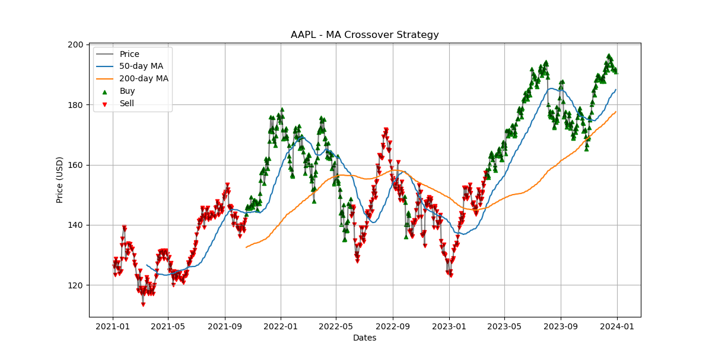
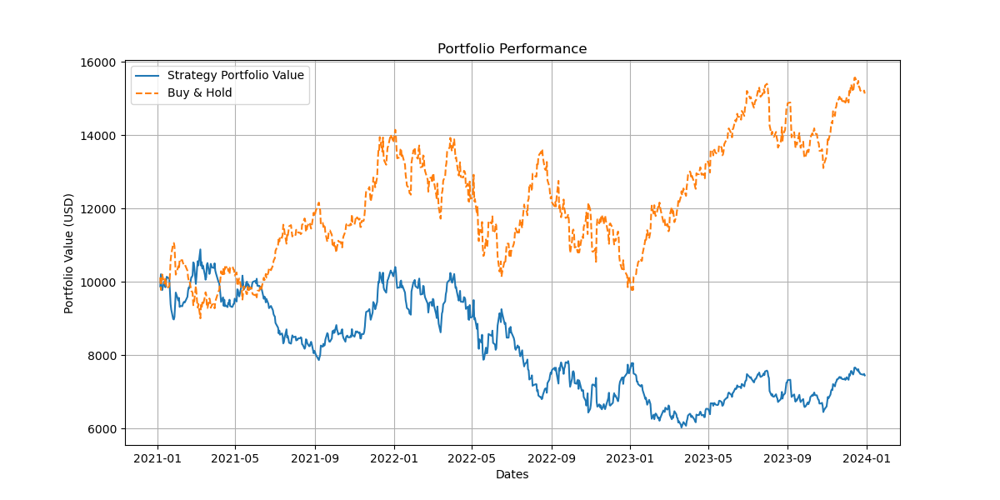

# MA Crossover Strategy Backtest

This repository contains the code and results for a backtest of a Moving Average (MA) Crossover trading strategy applied to AAPL stock data.

---

## Strategy Overview

The MA Crossover strategy uses two moving averages:

- **50-day Moving Average (MA)**
- **200-day Moving Average (MA)**

Buy signals are generated when the 50-day MA crosses above the 200-day MA, and sell signals are triggered when the 50-day MA crosses below the 200-day MA.

---

## Backtest Results

| Metric          | Value     |
|-----------------|-----------|
| Strategy Return | -25.52%   |
| Sharpe Ratio    | -21.56%   |
| Max Drawdown    | 44.65%    |

---

## Interpretation

- The strategy produced a **negative return of -25.52%** over the backtested period, indicating underperformance.
- The **Sharpe Ratio of -21.56%** suggests the strategy took on significant risk without adequate compensation.
- A **Max Drawdown of 44.65%** highlights substantial peak-to-trough losses, indicating high volatility and risk.

---

## Visuals

### 1. Price and Moving Averages with Buy/Sell Signals

This plot shows AAPL's daily closing prices along with the 50-day and 200-day moving averages. Green triangles indicate buy signals and red inverted triangles indicate sell signals.

---

### 2. Portfolio Performance

This plot compares the portfolio value using the MA Crossover strategy (blue line) against a Buy & Hold strategy (orange dashed line). The Buy & Hold strategy outperformed the MA Crossover strategy in this backtest.

---

## Conclusion and Next Steps

The MA Crossover strategy underperformed the Buy & Hold benchmark in this backtest. Its negative returns, low Sharpe ratio, and significant drawdown suggest it may not be a robust strategy on its own for AAPL over this period.

**Next steps could include:**

- Incorporating additional indicators to improve signal accuracy
- Adjusting moving average windows or adding smoothing techniques
- Applying the strategy to other stocks or asset classes for diversification
- Evaluating different risk management or position sizing methods

---

## Usage

To run the backtest and generate these visuals, execute the provided Python scripts with the required dependencies (`pandas`, `matplotlib`, etc.).

---

